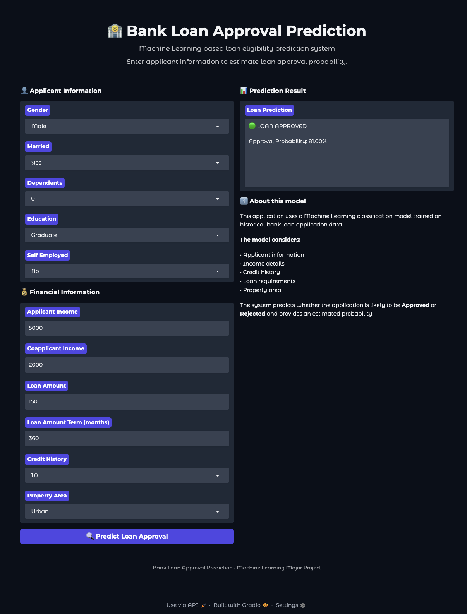
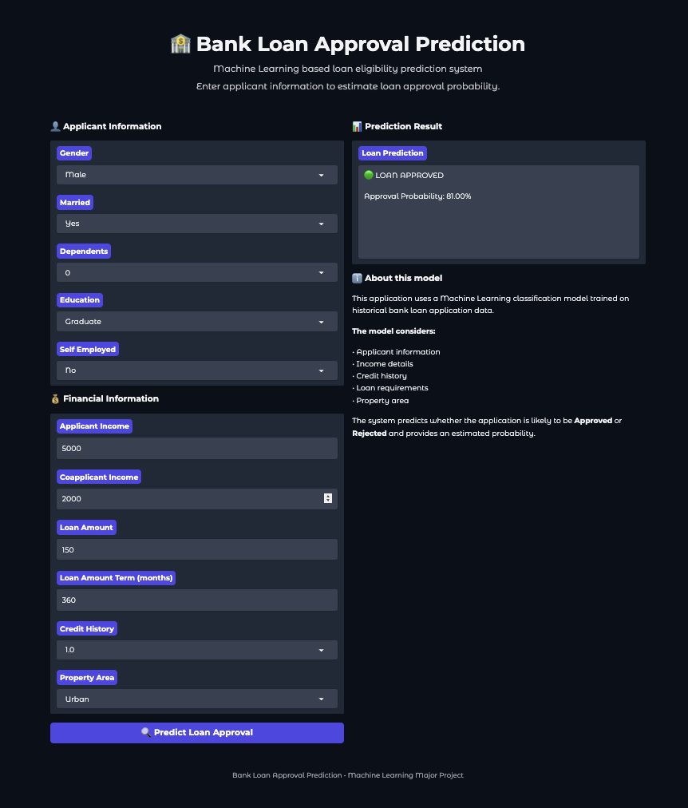

  

# 🏦 Bank Loan Approval Prediction

### Machine Learning Based Loan Eligibility Prediction System

An intelligent machine learning application that predicts whether a bank loan application is likely to be **Approved** or **Rejected** based on applicant, financial, credit, loan, and property-related information.

The project also provides an estimated **approval probability** through an interactive Gradio web application.

---

## 📌 Project Overview

Loan approval decisions depend on several factors such as income, credit history, loan amount, education, employment status, and property location.

This project uses machine learning to analyze historical loan application data and build a classification model capable of predicting loan approval outcomes.

The system provides:

- ✅ Loan approval/rejection prediction
- 📊 Approval probability
- 📈 Model performance evaluation
- 🔍 Feature importance analysis
- 🖥️ Interactive web interface using Gradio

---

## 🚀 Web Application Demo

The project includes an interactive **Gradio web application** that allows users to enter applicant and financial information and receive a loan approval prediction with an estimated probability.

  

### ✨ Application Features

- 👤 Applicant information input
- 💰 Financial information analysis
- 📊 Loan approval/rejection prediction
- 📈 Approval probability estimation
- 🧠 Machine learning based prediction
- 🖥️ Interactive Gradio interface

---
## 🎯 Objectives

- Develop a machine learning model for loan approval prediction.
- Perform data preprocessing and feature encoding.
- Analyze important factors influencing loan approval.
- Evaluate the model using multiple performance metrics.
- Build an interactive prediction application.
- Provide probability-based loan approval predictions.

---

## 🧠 Machine Learning Workflow

Data Collection
      ↓
Data Cleaning
      ↓
Exploratory Data Analysis
      ↓
Feature Encoding
      ↓
Train-Test Split
      ↓
Model Training
      ↓
Model Evaluation
      ↓
Probability Prediction
      ↓
Interactive Gradio Application

---

## 📊 Model Performance

The trained machine learning model was evaluated on the test dataset using multiple classification metrics.

| Metric | Score |
|---|---:|
| 🎯 Accuracy | **83.74%** |
| 🎯 Precision | **84.95%** |
| 🔍 Recall | **92.94%** |
| ⭐ F1 Score | **88.76%** |

### Performance Summary

- **83.74% Accuracy** indicates strong overall prediction performance.
- **84.95% Precision** shows that most predicted loan approvals were correct.
- **92.94% Recall** indicates that the model successfully identified most actual approved loan applications.
- **88.76% F1 Score** demonstrates a strong balance between precision and recall.

